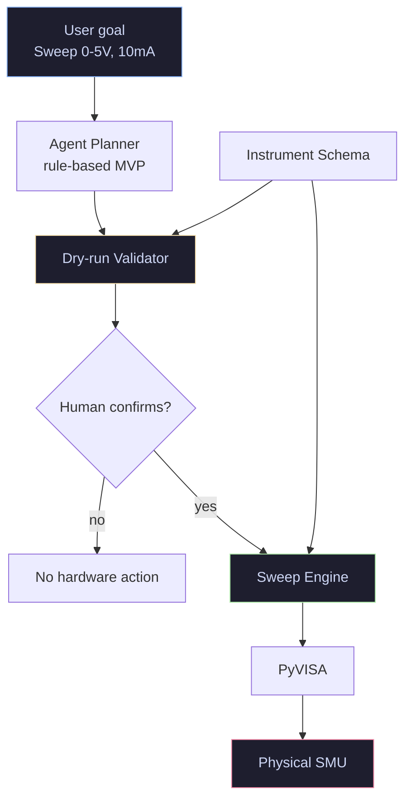
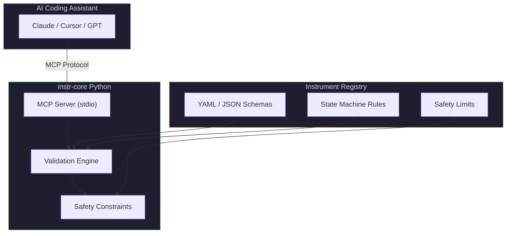
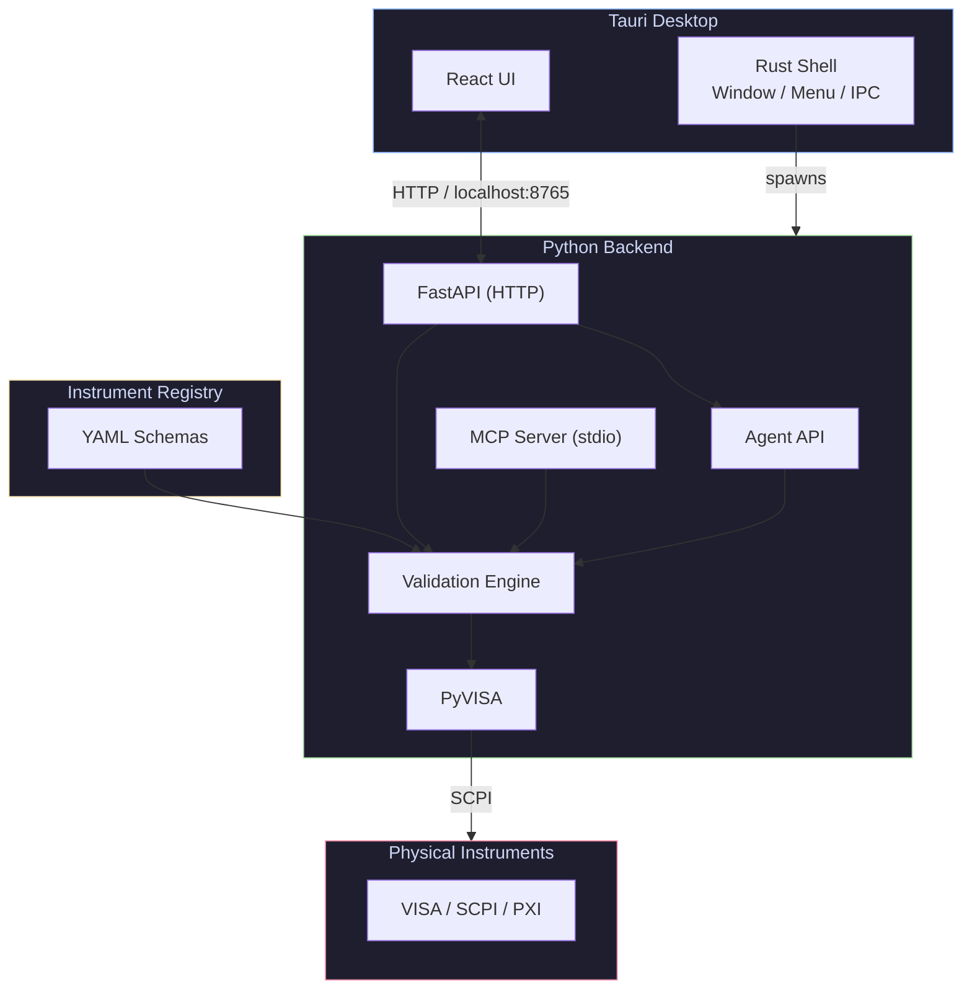

<div align="center">

# instr-core

**An AI experiment agent and physical safety layer for instrument control.**

[](./LICENSE)
[](https://www.python.org/)
[]()
[](./README_zh-CN.md)

[instr.cc](https://instr.cc) · [中文](./README_zh-CN.md)

</div>

---

## What Is instr-core?

`instr-core` is an AI-native instrument-control core. It lets AI systems plan laboratory experiments, validate every hardware command against structured instrument schemas, run safe dry-runs by default, and execute on real VISA/SCPI instruments only after explicit confirmation.

The project has three layers:

1. **Agent layer** — turns a high-level experiment request into a structured, verifiable plan.
2. **Safety layer** — validates ranges, state transitions, compliance settings, output state, and command order.
3. **Runtime layer** — exposes the same core through MCP, FastAPI, and a Tauri desktop app.

The first agent workflows are **AI-driven IV sweep** and a **dual Keithley
software-synchronized sweep**:

```text
Natural-language goal
  → structured IV sweep plan
  → dry-run validation
  → explicit confirmation
  → PyVISA execution
  → data, CSV, chart, and run summary

Keithley 2600 source + Keithley DMM6500 meter
  → structured dual-device plan
  → dry-run validation for both schemas
  → explicit confirmation
  → software-synchronized measurement loop
  → CSV, chart, and run summary
```

---

## Why Is AI-Controlled Hardware Dangerous?

Today's general-purpose LLMs (such as GPT-4o, Claude 3.5 Sonnet) do understand Python, and some have even memorized PyVISA's API documentation. But they have two fatal flaws:

**They don't have the manual for *this* instrument:**

The same Keithley power supply can have completely different low-level SCPI command details and register status bits between model 2400 and 2450. AI often "guesses" when writing commands, which easily leads to errors.

**They have no physical common sense or safety boundaries:**

AI doesn't know that a precision device rated for only 10V will literally be destroyed if you write `SOUR:VOLT 50` to it. It's just outputting text.

---

## How Does instr-core Assist AI?

This project turns instrument operation into a plan-validate-execute workflow for AI agents:

**Feeding AI a structured "instrument dictionary" (Schema):**

Instead of dumping hundreds of pages of English PDF manuals on the AI and letting it slowly summarize, instr-core advocates using standardized YAML/JSON files to solidify an instrument's capabilities, ranges, and command sets. Before writing code, the AI reads this Schema (context) and instantly knows what the instrument can and cannot do.

**Mandatory dry-run and validation:**

When an AI proposes an experiment or a SCPI command, instr-core validates it first. It checks: Is this voltage out of range? Has compliance been set? Is output currently on? Does this command violate the instrument state machine? If the plan is unsafe, it returns issues and suggestions instead of touching hardware.

Validation fails closed: if no trusted instrument Schema can be resolved, the
command is reported as invalid. Connect a recognized instrument or provide an
explicit Schema key before attempting hardware writes.

**Confirmed execution only:**

Agent plans start in `dry_run` mode. Real execution requires an explicit confirmation flag and a valid dry-run result. This is the core physical-safety boundary: AI may plan, but it cannot silently energize hardware.

---

## AI Experiment Agent

The new agent surface is designed for workflows where a user describes an experiment, not a command sequence.

Example request:

```text
Sweep 0V to 5V in 0.1V steps with 10mA compliance on the connected Keithley.
```

The Agent API parses that into a structured plan:

```json
{
  "experiment_type": "iv_sweep",
  "mode": "dry_run",
  "instrument_key": "keithley/smu/2600",
  "address": "USB0::INSTR",
  "config": {
    "start_voltage": 0,
    "stop_voltage": 5,
    "step": 0.1,
    "compliance": 0.01,
    "delay_ms": 10,
    "direction": "UP"
  },
  "requires_confirmation": true
}
```

Current Agent API endpoints:

| Endpoint | Purpose |
| --- | --- |
| `POST /agent/plan` | Parse a natural-language IV sweep goal into a structured plan. |
| `POST /agent/dry-run` | Validate the plan, expand command preview, estimate points, and report safety issues. |
| `POST /agent/execute` | Start the sweep only after valid dry-run and `confirm=true`. |
| `GET /agent/runs` | List persisted run records across single-device and multi-device workflows. |
| `GET /agent/runs/{run_id}` | Inspect the stored agent run, validation result, and linked sweep session. |
| `POST /agent/llm/plan` | Ask a configured LLM to produce a structured dual-device plan request. |
| `POST /agent/multi/plan` | Create a structured Keithley 2600 + DMM6500 dual-device sweep plan. |
| `POST /agent/multi/dry-run` | Validate source and meter schemas without opening VISA resources. |
| `POST /agent/multi/execute` | Execute the software-synchronized dual-device loop after confirmation. |
| `GET /agent/multi/runs/{run_id}` | Inspect a stored dual-device run and captured result. |
| `GET /agent/multi/runs/{run_id}/export` | Export dual-device results as CSV. |

The single-device IV sweep parser remains deterministic. The dual-device workflow
also supports an optional LLM planner, but the safety boundary is unchanged: the
LLM must return a typed `DualKeithleyPlanRequest`, never raw SCPI, and the run
still requires dry-run validation before execution.

---

## What Does This Mean for Future Test Engineers?

If this model (a Schema-based AI hardware driver layer) matures and becomes an industry standard, the way hardware test engineers work will be fundamentally transformed:

**Past:**

Engineers held multimeters and instrument programming manuals in hand, typing SCPI commands line by line and wrapping low-level Python classes.

**Future:**

Engineers become "rule makers." Your core job is to write and maintain instrument YAML Schemas (defining safety boundaries and state machines), then give the AI high-level instructions: "Write me a script to scan the chip's leakage current from 1V to 5V, in 0.1V steps, and plot it on a chart." The remaining low-level handshaking and fool-proofing is automatically handled by AI + instr-core.

The engineer's core value shifts from "operator" to "rule designer" — the AI is merely the tool that executes the safety boundaries you define.

---

## Architecture

`instr-core` has one shared safety core and three runtime surfaces:

### 1. Agent API (Experiment Workflow)



### 2. MCP Server (AI Coding Workflow)


### 3. Desktop App (Human + AI Workflow)


The desktop app shares the same Python backend: users can manually control instruments, run validated IV sweeps, and later drive the same Agent API from a desktop task panel.

---

## MCP Tools

instr-core exposes the following tools to the AI via the MCP protocol. All calls happen **before** code generation; none directly touch hardware:

| Tool | Purpose |
| --- | --- |
| `validate_instrument_state` | Validate a single SCPI command (range, state, safety rules). |
| `validate_command_sequence` | Validate an entire command sequence, tracking cross-command state transitions. |
| `list_instruments` / `search_instruments` | Browse loaded instruments and their metadata in the Registry. |
| `get_command_tree` | Get the full SCPI command tree for an instrument. |
| `get_command_detail` | Get detailed constraints for a single command (range, requires, forbidden_when, safety). |
| `get_safety_limits` | Get global safety boundaries (max voltage, current, power). |
| `get_instrument_sop` | Prompt that injects the full instrument schema (including safety limits) into the AI context for safe code generation. |

---

## Instructions as Context

`instr-core` proposes a new principle:

> **Instructions as Context.**

| Traditional flow | instr-core |
| --- | --- |
| PDF manual → human reading → hand-written code | Structured schema → AI understanding → safely generated code |

---

## Schema Example

An `instr-core` schema is a complete instrument-description file, not just a command list. Below is a simplified structure based on the real registry:

```yaml
instrument:
  manufacturer: Keithley
  model: "2600"
  description: "Series 2600A System SourceMeter"

global_limits:
  voltage: {max: 40.0, unit: "V"}
  current: {max: 3.0, unit: "A"}
  power: {max: 200.0, unit: "W"}

commands:
  - command: ":SOUR:VOLT"
    description: "Set the source voltage level"
    parameters:
      - name: "voltage"
        type: "float"
    range:
      min: -40.0
      max: 40.0
    requires:
      source_mode: VOLT
    forbidden_when:
      output: ON
    safety:
      compliance_required: true
      compliance_parameter: ":SENS:CURR:PROT"
    sets_state:
      ":SOUR:VOLT": "$ARGUMENT"
```

Key fields:

- `global_limits` — Global safety boundaries (max voltage, current, power).
- `requires` — Pre-conditions that must be met before the command can execute (e.g., `:SOUR:VOLT` requires `source_mode: VOLT`).
- `forbidden_when` — States that prohibit execution (e.g., changing source value while `output: ON`).
- `safety` — Safety rules, such as whether compliance must be set first.
- `sets_state` — **The heart of the state-tracking engine.** It tells the system what state changes after the command runs (e.g., `$ARGUMENT` records the passed-in value). instr-core relies on this field to maintain a virtual instrument state across command sequences, enabling cross-command dependency and conflict checks.

The AI no longer merely "memorizes commands" — it receives **behavioral constraints on the instrument itself**.

---

## Example: Safe IV Sweep

**Without instr-core:**

```python
smu.write(":SOUR:VOLT 200")   # May exceed instrument range (2600 max 40V)
smu.write(":OUTP ON")         # No compliance set — DUT may burn from over-current
```

Potential problems:

- Does not check `global_limits.voltage.max`
- Enables output without `:SENS:CURR:PROT`, violating `safety.compliance_required`
- Does not confirm `source_mode` is `VOLT`

**With instr-core:**

The AI first reads the Schema and learns:
- `:SOUR:VOLT` valid range is `[-40.0, 40.0]`
- `:OUTP ON` requires compliance keys (`:SENS:CURR:PROT` or `:SENS:VOLT:PROT`) to be present beforehand (defined by `safety.sequence.require_state_keys_present`)
- `:SOUR:VOLT` is forbidden when `output: ON` (per `forbidden_when`)

It then generates safe code:

```python
smu.write("*RST")
smu.write(":OUTP OFF")
smu.write(":SOUR:FUNC VOLT")          # Satisfies requires.source_mode
smu.write(":SENS:CURR:PROT 0.01")     # Set compliance first (10mA)
smu.write(":SOUR:VOLT:RANG 20")
smu.write(":SOUR:VOLT 0")
smu.write(":OUTP ON")
# ... sweep logic, each step within [-40, 40]
smu.write(":OUTP OFF")                # Schema recommends output OFF after test
```

---

## Quick Start

### Prerequisites

- [uv](https://docs.astral.sh/uv/) for Python package and environment management
- [Node.js](https://nodejs.org/) (>= 20) for the desktop UI
- [Rust](https://rustup.rs/) (>= 1.75) for the Tauri shell

### 1. Install & Run the Python Core / MCP Server

```bash
# Clone the repository
git clone <repo-url>
cd instr-core

# Sync Python dependencies
uv sync

# Run the MCP server
uv run instr-core
```

### 2. Desktop App (Tauri + React + Python)

The desktop app provides a modern native UI for instrument control while keeping the same Python backend and MCP server.

```bash
# 1. Start the Python API backend
uv run python src/instr_core/api_server.py

# 2. In a second terminal, start the Tauri dev environment
cd desktop
npm install
cargo tauri dev
```

The desktop window will open at `http://localhost:1420`, communicating with the Python backend at `http://localhost:8765`.

**Build for production:**

```bash
cd desktop
cargo tauri build
# Output: desktop/src-tauri/target/release/bundle/
```

### 3. Agent API: Plan, Dry-Run, Execute

Start the Python API backend:

```bash
uv run python src/instr_core/api_server.py
```

Create a plan:

```bash
curl -X POST http://localhost:8765/agent/plan \
  -H "Content-Type: application/json" \
  -d '{
    "goal": "Sweep 0V to 5V in 0.5V steps with 10mA compliance",
    "instrument_key": "keithley/smu/2600",
    "address": "USB0::INSTR"
  }'
```

If the instrument was connected through `/visa/connect`, the Agent API can infer `instrument_key` from the address mapping. Supplying it explicitly is useful for dry-run planning and tests.

Dry-run the returned `run_id`:

```bash
curl -X POST http://localhost:8765/agent/dry-run \
  -H "Content-Type: application/json" \
  -d '{"run_id": "run-xxxxxxxx"}'
```

Execute only after review:

```bash
curl -X POST http://localhost:8765/agent/execute \
  -H "Content-Type: application/json" \
  -d '{"run_id": "run-xxxxxxxx", "confirm": true}'
```

The execute step is intentionally confirmation-gated. Calling it without `confirm=true` returns an error.

### 4. Dual Keithley Agent: 2600 + DMM6500

The benchmark multi-instrument workflow uses a Keithley 2600 SMU as a voltage
source and a Keithley DMM6500 as a DC-voltage meter. It is software-synchronized:
the source steps one bias point, the meter reads one value, and the run records
`source_voltage`, `meter_value`, and `timestamp`.

```bash
curl -X POST http://localhost:8765/agent/multi/plan \
  -H "Content-Type: application/json" \
  -d '{
    "goal": "Sweep 0V to 1V in 0.5V steps and measure DUT voltage with DMM6500",
    "source": {
      "address": "USB0::SMU::INSTR",
      "instrument_key": "keithley/smu/2600"
    },
    "meter": {
      "address": "USB0::DMM::INSTR",
      "instrument_key": "keithley/dmm/dmm6500"
    },
    "source_config": {
      "start_voltage": 0,
      "stop_voltage": 1,
      "step": 0.5,
      "compliance": 0.01,
      "delay_ms": 0,
      "direction": "UP"
    },
    "meter_config": {
      "function": "VOLT:DC",
      "range": 10
    }
  }'
```

Then dry-run and execute the returned `run_id`:

```bash
curl -X POST http://localhost:8765/agent/multi/dry-run \
  -H "Content-Type: application/json" \
  -d '{"run_id": "run-xxxxxxxx"}'

curl -X POST http://localhost:8765/agent/multi/execute \
  -H "Content-Type: application/json" \
  -d '{"run_id": "run-xxxxxxxx", "confirm": true}'

curl http://localhost:8765/agent/multi/runs/run-xxxxxxxx/export
```

The Tauri desktop app exposes the same workflow as the **Keithley Dual** panel.

The desktop frontend uses mature open-source UI infrastructure:

- React + Vite for the app runtime
- shadcn-like local primitives for buttons and card composition
- ECharts for sweep and dual-device charts
- i18next / react-i18next for Chinese and English UI internationalization

### 5. LLM Structured Planning and Run Records

`/agent/llm/plan` uses an OpenAI-compatible chat completions endpoint when an API
key is configured. The LLM is constrained to return JSON matching the
`DualKeithleyPlanRequest` schema. instr-core then creates a normal planned run;
it does not execute hardware and does not bypass dry-run validation.

```bash
export INSTR_CORE_LLM_API_KEY="sk-..."
export INSTR_CORE_LLM_MODEL="gpt-5.5"
# Optional for OpenAI-compatible local or proxy endpoints:
export INSTR_CORE_LLM_BASE_URL="https://api.openai.com/v1/chat/completions"
```

```bash
curl -X POST http://localhost:8765/agent/llm/plan \
  -H "Content-Type: application/json" \
  -d '{
    "goal": "Use the 2600 to sweep 0 to 1 V in 0.1 V steps and read voltage on DMM6500",
    "experiment_type": "dual_keithley_sweep"
  }'
```

Agent runs are persisted as JSON records. By default they are stored in:

```text
~/.instr-core/runs/
```

Override the location for tests, lab machines, or shared workspaces:

```bash
export INSTR_CORE_RUNS_DIR="/path/to/instr-core-runs"
```

List recorded runs:

```bash
curl http://localhost:8765/agent/runs
```

### 6. Configure your IDE / AI Assistant (MCP)

> **Note:** When configuring in an IDE, the working directory may not be the project root. Use an **absolute path** for the registry, or set the `INSTR_CORE_REGISTRY` environment variable.

**Claude Desktop** — edit the config file:

- **macOS**: `~/Library/Application Support/Claude/claude_desktop_config.json`
- **Windows**: `%APPDATA%\Claude\claude_desktop_config.json`

```json
{
  "mcpServers": {
    "instr-core": {
      "command": "uv",
      "args": ["run", "--cwd", "/absolute/path/to/instr-core", "instr-core"]
    }
  }
}
```

Or, if `uv` is not on the system `PATH` inside Claude Desktop:

```json
{
  "mcpServers": {
    "instr-core": {
      "command": "uv",
      "args": [
        "run",
        "instr-core"
      ],
      "env": {
        "PATH": "/path/to/your/env/bin"
      }
    }
  }
}
```

**Cursor** — add to `.cursor/mcp.json`:

```json
{
  "mcpServers": {
    "instr-core": {
      "command": "uv",
      "args": ["run", "--cwd", "/absolute/path/to/instr-core", "instr-core"]
    }
  }
}
```

**Claude Code** — add to `.claude/settings.json`:

```json
{
  "mcpServers": {
    "instr-core": {
      "command": "uv",
      "args": ["run", "--cwd", "/absolute/path/to/instr-core", "instr-core"]
    }
  }
}
```

### 5. What happens next

After configuration, the AI assistant gains access to instrument-aware tools. Here is what a typical session looks like:

**You type in the AI chat:**

> Write a Python script to run an IV sweep on a Keithley 2600, 0-20V, 10mA compliance.

**Without instr-core**, the AI generates:

```python
# AI hallucinated output — looks plausible, potentially destructive
smu = visa.ResourceManager().open_resource("USB0::0x05E6::0x2600::INSTR")
smu.write(":SOUR:FUNC VOLT")
smu.write(":SOUR:VOLT 20")          # No range check
smu.write(":OUTP ON")                # No compliance set — DUT at risk
```

**With instr-core**, the AI first queries the schema and generates:

```python
# Schema-informed output — constraints applied
smu = visa.ResourceManager().open_resource("USB0::0x05E6::0x2600::INSTR")
smu.write(":SOUR:FUNC VOLT")
smu.write(":SENS:CURR:PROT 0.01")    # Compliance from schema: 10mA
smu.write(":SOUR:VOLT:RANG 20")      # Explicit range declaration
smu.write(":SOUR:VOLT 0")            # Start from safe state
smu.write(":OUTP ON")
# ... sweep logic with schema-aware voltage steps
smu.write(":OUTP OFF")               # Schema requires output off at end
```

The AI also surfaces a validation summary:

> **instr-core validation passed**
> - Compliance: 10mA set
> - Voltage range: 0-20V (within instrument limit)
> - Output state: OFF before sweep, OFF after sweep
> - Source mode: VOLT (matches requirement)

---

## Core Features

- **AI experiment agent** — natural-language IV sweep planning, dry-run validation, confirmation-gated execution, and run tracking.
- **LLM structured planning** — optional OpenAI-compatible planning that produces typed experiment requests, not raw SCPI.
- **Persistent experiment records** — plan, validation, status, linked sessions, and results are written as JSON run records.
- **Dual Keithley benchmark workflow** — Keithley 2600 source + DMM6500 meter planning, dry-run validation, confirmed execution, result capture, and CSV export.
- **Standardized instrument schema** — structured YAML / JSON in place of PDF manuals.
- **Safety validation layer** — prevents out-of-range values, illegal state transitions, dangerous outputs, and invalid mode combinations.
- **FastAPI Agent API** — reusable single-device and multi-device `/agent` endpoints for plan, dry-run, execute, inspect, and export.
- **Native MCP support** — compatible with Cursor, Claude Code, Windsurf, and VSCode AI agents.
- **Python runtime core** — built on the official [MCP Python SDK](https://github.com/modelcontextprotocol/python-sdk) (FastMCP), easy to extend and integrate with existing Python instrument-control workflows.
- **Community instrument registry** — Keithley, Keysight, Tektronix, Rohde & Schwarz, NI PXI, and other SCPI instruments.
- **Desktop application** (Tauri + React + Python) — modern native UI for instrument discovery, SCPI terminal, and manual control. Ships as a single binary.

---

## Project Philosophy

`instr-core` is **not**:

- A SCPI autocomplete tool
- A PDF-to-YAML converter
- A system that lets AI bypass human confirmation before energizing hardware

It **is**:

> **An AI experiment-agent core with a conservative physical safety layer.**

The goal is not to replace engineers, but to let AI propose and operate experiments inside explicit, reviewable, schema-verified safety boundaries.

---

## Safety Statement

**Human review is always required before executing on real hardware.**

`instr-core` provides:

- Dry-run planning
- Constraint validation
- State checking
- Command semantics
- Confirmation-gated execution
- Risk reduction

It **does not guarantee**:

- That the generated code is correct
- That the instrument is safe
- That hardware will not be damaged

---

## Desktop App

`instr-core` ships with an optional native desktop application built on **Tauri** (Rust shell) + **React** (UI) + **Python** (backend).

### Why a desktop app?

The MCP server is great for AI-assisted coding, but engineers also need a standalone tool for:
- Quickly scanning VISA resources and connecting to instruments
- Manually sending SCPI commands with real-time validation feedback
- Viewing instrument schemas and safety limits in a browsable UI
- Running IV sweeps and capturing data without writing Python scripts
- Running the Keithley 2600 + DMM6500 dual-device benchmark workflow from a guided panel

### Architecture

```
┌─────────────────────────────┐
│  Tauri (Rust + Web UI)      │  ← User-facing native window
│  - React instrument panels  │
│  - SCPI terminal            │
│  - Data visualization       │
└──────┬──────────────────────┘
       │ HTTP / WebSocket (localhost)
       ▼
┌─────────────────────────────┐
│  Python Backend             │  ← Shared with MCP workflow
│  - FastAPI local service    │
│  - PyVISA instrument comms  │
│  - MCP Server (for AI)      │
│  - Validation Engine        │
└─────────────────────────────┘
```

The Rust shell (`desktop/src-tauri/`) spawns the Python backend on startup and opens the React UI in a native window. The UI talks to Python via HTTP on `localhost:8765`.

### Communication

| Layer | Technology | Responsibility |
|---|---|---|
| Shell | Tauri (Rust) | Window management, menu bar, native dialogs, process lifecycle |
| Frontend | React + Vite | Instrument panels, SCPI terminal, charts, settings |
| Transport | HTTP / REST | JSON API between React and Python |
| Backend | FastAPI + uvicorn | Request routing, VISA resource management, validation |
| Engine | Python (shared) | Schema parsing, command validation, state tracking |

### File Layout

```text
desktop/
├── package.json              # Node deps (React, Tauri API)
├── vite.config.ts            # Vite dev server (port 1420)
├── tsconfig.json
├── index.html
└── src/
    ├── main.tsx              # React entry
    ├── App.tsx               # Main layout (panels + terminal)
    └── App.css               # Dark theme styles
└── src-tauri/
    ├── Cargo.toml            # Rust deps (Tauri)
    ├── tauri.conf.json       # Window config, bundle settings
    ├── build.rs
    └── src/
        ├── main.rs           # Spawns Python backend, manages lifecycle
        └── lib.rs
```

## Registry Layout

```text
tests/fixtures/registry/
└── keithley/
    └── smu/
        └── 2600.yaml
```

Each schema may contain:

- Firmware version
- SCPI command tree
- Parameter constraints
- State-machine rules
- Safety limits
- Authoritative documentation source

---

## Roadmap

**Current focus**

- AI IV sweep agent
- Keithley 2600 + DMM6500 benchmark workflow
- LLM-backed structured planning
- Persistent experiment records
- SCPI SourceMeter
- PyVISA workflows
- Dry-run-first hardware execution
- **Tauri desktop app** — instrument panels, SCPI terminal, IV sweep, dual Keithley sweep, and data capture

**Planned**

- MCP tools for experiment planning and execution
- Hardware trigger topology and arm/fire/teardown state models
- Oscilloscope semantic model
- PXI system support
- Binary protocols
- Real-instrument validation
- Capability graph
- Automated PDF parsing
- Hardware execution sandbox
- Richer data visualization (plots, sweeps, measurements)
- Hardware-synchronized multi-instrument sequences

---

## Long-Term Vision

AI is moving from "generating code" to "controlling the physical world". The physical world requires:

- Type systems
- State verification
- Safety constraints
- Traceability
- Execution semantics

`instr-core` aims to become:

> **A trusted context layer between AI and real hardware.**

---

## Contributing

Contributions welcome:

- Instrument schemas
- SCPI semantics
- Safety rules
- PXI support
- Protocol adapters
- Real-instrument testing

---

## License

[MIT](./LICENSE)
