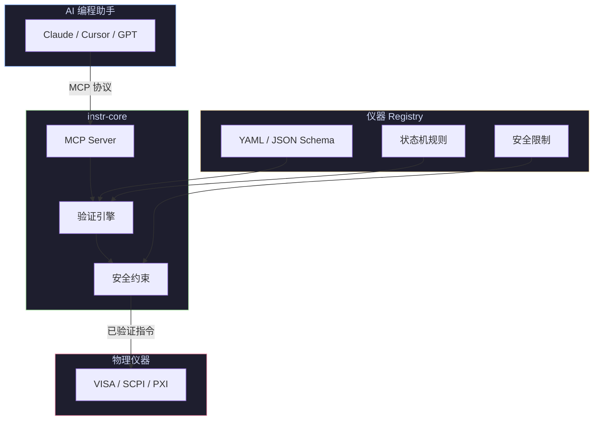

<div align="center">

# instr-core

**为 AI 编程助手提供安全、可验证的仪器控制上下文。**

[](./LICENSE)
[](https://www.python.org/)
[]()
[](./README.md)

[instr.cc](https://instr.cc) · [English](./README.md)

</div>

---

## 为什么 AI 直接写仪器控制会有问题？

现在的通用大模型（比如 GPT-4o、Claude 3.5 Sonnet）确实懂 Python，甚至背过 PyVISA 的 API 文档。但是它们有两个致命缺陷：

**没有"这台"仪器的说明书：**

同样的吉时利（Keithley）电源，型号 2400 和 2450 的底层 SCPI 指令细节、寄存器状态位可能完全不同。AI 经常靠"猜"来写指令，很容易报错。

**没有物理常识与安全边界：**

AI 不知道一台只能承受 10V 的精密设备，如果被写入了 `SOUR:VOLT 50` 会直接烧毁。它只是在输出文本。

---

## instr-core 是如何"辅助" AI 的？

这个项目采用了 AI Agent 领域最主流的 MCP (Model Context Protocol) 思想，将传统的人类工作流转变为 AI 工作流：

**给 AI 喂结构化的"仪器字典" (Schema)：**

不需要人类把几百页的英文 PDF 手册丢给 AI 让它慢慢总结。instr-core 提倡用标准化的 YAML/JSON 文件把仪器的能力、量程、指令集固化下来。AI 写代码前，直接读取这个 Schema（上下文），瞬间就知道这台仪器能干什么、不能干什么。

**强制的"拦截与校验" (Validation)：**

当 AI（或者人类用 Copilot）写出了一段调用硬件的代码，instr-core 的底层会进行拦截。它会核对：这个电压超限了吗？这个通道现在是开启状态吗？如果不符合规则，直接在软件层面报错，绝对不把危险指令发给物理串口或网口。

---

## 这对未来的测试工程师意味着什么？

如果这种模式（基于 Schema 的 AI 硬件驱动层）成熟并成为行业标准，硬件测试工程师的工作方式将发生彻底改变：

**过去：**

工程师手里拿着万用表和仪器编程手册，一行行手敲 SCPI 指令，封装底层的 Python 类。

**未来：**

工程师转变为"规则制定者"。你的核心工作是编写和维护仪器的 YAML Schema（定义安全边界、状态机），然后对 AI 下达高层级指令："帮我写一个脚本，扫描 1V 到 5V 之间芯片的漏电流，步进 0.1V，并在图表上画出来。" 剩下的底层握手、防呆设计，全部由 AI + instr-core 自动完成。

工程师的核心价值从"操作者"升维为"规则设计者"，AI 只是执行你定义安全边界的工具。

---

## 架构



---

## 核心工具

instr-core 通过 MCP 协议向 AI 暴露以下工具，所有调用均在代码生成前完成，绝不直接操作硬件：

| 工具 | 作用 |
| --- | --- |
| `validate_instrument_state` | 校验单条 SCPI 命令是否合法（量程、状态、安全规则）。 |
| `validate_command_sequence` | 校验一整段命令序列，追踪跨命令的状态变迁。 |
| `list_instruments` / `search_instruments` | 浏览 Registry 中已加载的仪器及其元数据。 |
| `get_command_tree` | 获取某台仪器的完整 SCPI 指令树。 |
| `get_command_detail` | 获取单条指令的详细约束（range、requires、forbidden_when、safety）。 |
| `get_safety_limits` | 获取仪器的全局安全边界（电压、电流、功率上限）。 |
| `get_instrument_sop` (prompt) | 根据仪器 Schema 生成带安全检查的 PyVISA 代码模板。 |

---

## 指令即上下文（Instructions as Context）

`instr-core` 提出了一个新的理念：

> **指令即上下文（Instructions as Context）**

| 传统方式 | instr-core |
| --- | --- |
| PDF 手册 → 人类阅读 → 手写代码 | 结构化 Schema → AI 理解 → 安全生成代码 |

---

## Schema 示例

`instr-core` 的 Schema 是一个完整的仪器描述文件，而不仅是命令列表。以下是一个基于真实 registry 的简化结构：

```yaml
instrument:
  manufacturer: Keithley
  model: "2600"
  description: "Series 2600A System SourceMeter"

global_limits:
  voltage: {max: 40.0, unit: "V"}
  current: {max: 3.0, unit: "A"}
  power: {max: 200.0, unit: "W"}

commands:
  - command: ":SOUR:VOLT"
    description: "Set the source voltage level"
    parameters:
      - name: "voltage"
        type: "float"
    range:
      min: -40.0
      max: 40.0
    requires:
      source_mode: VOLT
    forbidden_when:
      output: ON
    safety:
      compliance_required: true
      compliance_parameter: ":SENS:CURR:PROT"
    sets_state:
      ":SOUR:VOLT": "$ARGUMENT"
```

关键字段说明：

- `global_limits` — 全局安全边界（电压、电流、功率上限）。
- `requires` — 命令执行的前置状态条件（例如 `:SOUR:VOLT` 只能在 `source_mode: VOLT` 时执行）。
- `forbidden_when` — 禁止执行的状态（例如输出开启时禁止修改源值）。
- `safety` — 安全规则，如是否必须先设置 compliance。
- `sets_state` — **状态追踪引擎的核心**。它告诉系统该命令执行后会改变什么状态（例如 `$ARGUMENT` 表示把传入的参数值记录到状态中）。instr-core 依靠这个字段在命令序列中维护虚拟仪器状态，从而实现跨命令的依赖与冲突检查。

这意味着 AI 不再只是"记忆指令"，而是真正获得 **仪器行为约束**。

---

## 示例：安全 IV Sweep

**没有 instr-core：**

```python
smu.write(":SOUR:VOLT 200")   # 可能超出仪器量程（2600 最大 40V）
smu.write(":OUTP ON")         # 未设置 compliance，DUT 可能过流烧毁
```

潜在问题：
- 未检查 `global_limits.voltage.max`
- 未设置 `:SENS:CURR:PROT` 即开启输出，违反 `safety.compliance_required`
- 未确认 `source_mode` 是否为 `VOLT`

**使用 instr-core：**

AI 先读取 Schema，了解到：
- `:SOUR:VOLT` 的合法范围是 `[-40.0, 40.0]`
- `:OUTP ON` 之前必须已配置 compliance 键（`:SENS:CURR:PROT` 或 `:SENS:VOLT:PROT`）（由 `safety.sequence.require_state_keys_present` 定义）
- `:SOUR:VOLT` 在 `output: ON` 时被 `forbidden_when` 禁止

于是生成安全代码：

```python
smu.write("*RST")
smu.write(":OUTP OFF")
smu.write(":SOUR:FUNC VOLT")          # 满足 requires.source_mode
smu.write(":SENS:CURR:PROT 0.01")     # 先设置 compliance（10mA）
smu.write(":SOUR:VOLT:RANG 20")
smu.write(":SOUR:VOLT 0")
smu.write(":OUTP ON")
# ... sweep 逻辑，每步电压都在 [-40, 40] 范围内
smu.write(":OUTP OFF")                # Schema 建议测试结束后关闭输出
```

---

## 快速开始

### 1. 前置要求

- [uv](https://docs.astral.sh/uv/) 用于 Python 包和环境管理

### 2. 安装与运行

```bash
# 克隆仓库
git clone <repo-url>
cd instr-core

# 直接使用 uv 运行
uv run instr-core

# 或安装到当前环境
uv pip install -e .
instr-core
```

也可以使用 `mcp` CLI 直接安装到 **Claude Desktop**：

```bash
# 安装到 Claude Desktop（需要已安装 Claude Desktop 应用）
uv run mcp install src/instr_core/main.py

# 或通过环境变量指定 registry 路径
INSTR_CORE_REGISTRY=/absolute/path/to/registry uv run mcp install src/instr_core/main.py

# 使用 MCP Inspector 开发调试
uv run mcp dev src/instr_core/main.py
```

### 3. 配置你的 IDE / AI 助手

> **注意：** IDE 中配置时，工作目录可能不是项目根目录。请使用 **绝对路径** 指定 registry，或设置 `INSTR_CORE_REGISTRY` 环境变量。

**Claude Desktop** — 编辑配置文件：

- **macOS**: `~/Library/Application Support/Claude/claude_desktop_config.json`
- **Windows**: `%APPDATA%\Claude\claude_desktop_config.json`

```json
{
  "mcpServers": {
    "instr-core": {
      "command": "uv",
      "args": ["run", "--cwd", "/absolute/path/to/instr-core", "instr-core"]
    }
  }
}
```

或者，如果 Claude Desktop 中 `uv` 不在系统 `PATH` 上：

```json
{
  "mcpServers": {
    "instr-core": {
      "command": "uv",
      "args": [
        "run",
        "instr-core"
      ],
      "env": {
        "PATH": "/path/to/your/env/bin"
      }
    }
  }
}
```

**Cursor** — 添加到 `.cursor/mcp.json`：

```json
{
  "mcpServers": {
    "instr-core": {
      "command": "uv",
      "args": ["run", "--cwd", "/absolute/path/to/instr-core", "instr-core"]
    }
  }
}
```

**Claude Code** — 添加到 `.claude/settings.json`：

```json
{
  "mcpServers": {
    "instr-core": {
      "command": "uv",
      "args": ["run", "--cwd", "/absolute/path/to/instr-core", "instr-core"]
    }
  }
}
```

### 4. 配好之后是什么效果？

配置完成后，AI 助手将获得仪器感知能力。以下是典型的使用场景：

**你在 AI 对话框中输入：**

> 写一个 Python 脚本，在 Keithley 2600 上跑 IV sweep，0-20V，compliance 10mA。

**没有 instr-core 时**，AI 生成：

```python
# AI 幻觉输出 — 看起来合理，实际上可能损坏仪器
smu = visa.ResourceManager().open_resource("USB0::0x05E6::0x2600::INSTR")
smu.write(":SOUR:FUNC VOLT")
smu.write(":SOUR:VOLT 20")          # 没有检查量程
smu.write(":OUTP ON")                # 没有设置 compliance — DUT 有风险
```

**使用 instr-core 后**，AI 先查询 Schema，再生成：

```python
# Schema 驱动输出 — 约束已应用
smu = visa.ResourceManager().open_resource("USB0::0x05E6::0x2600::INSTR")
smu.write(":SOUR:FUNC VOLT")
smu.write(":SENS:CURR:PROT 0.01")    # Compliance 来自 Schema：10mA
smu.write(":SOUR:VOLT:RANG 20")      # 显式声明量程
smu.write(":SOUR:VOLT 0")            # 从安全状态开始
smu.write(":OUTP ON")
# ... sweep 逻辑，电压步进遵循 Schema 约束
smu.write(":OUTP OFF")               # Schema 要求结束后关闭输出
```

AI 还会输出验证摘要：

> **instr-core 验证通过**
> - Compliance：已设置 10mA
> - 电压范围：0-20V（在仪器限制内）
> - 输出状态：sweep 前 OFF，sweep 后 OFF
> - Source 模式：VOLT（匹配要求）

---

## 核心特性

- **标准化 Instrument Schema** — 用结构化 YAML / JSON 替代 PDF 手册。
- **安全验证层** — 防止超量程、非法状态切换、危险输出、错误模式组合。
- **原生 MCP 支持** — 兼容 Cursor、Claude Code、Windsurf、VSCode AI Agent。
- **Python 核心运行时** — 基于官方 [MCP Python SDK](https://github.com/modelcontextprotocol/python-sdk) (FastMCP)，易于扩展，可无缝集成现有 Python 仪器控制工作流。
- **社区仪器 Registry** — 支持 Keithley、Keysight、Tektronix、Rohde & Schwarz、NI PXI 以及更多 SCPI 仪器。

---

## 项目理念

`instr-core` **不是**:

- SCPI 自动补全工具
- PDF 转 YAML 工具
- AI 自动控制系统

它 **是**:

> **AI 硬件控制的验证与上下文层。**

目标不是替代工程师，而是 **让 AI 生成的硬件代码更安全、更可验证、更可追踪**。

---

## 安全声明

**真实硬件执行前，始终需要人工审核。**

`instr-core` 提供：

- 约束验证
- 状态检查
- 指令语义
- 风险降低

但 **不保证**:

- 代码绝对正确
- 仪器绝对安全
- 硬件绝对不会损坏

---

## Registry 结构

```text
tests/fixtures/registry/
└── keithley/
    └── smu/
        └── 2600.yaml
```

每个 Schema 可包含：

- 固件版本
- SCPI 指令树
- 参数约束
- 状态机规则
- 安全限制
- 官方文档来源

---

## Roadmap

**当前重点**

- Keithley 2400 / 2600
- SCPI SourceMeter
- PyVISA 工作流
- 安全代码生成

**未来计划**

- 示波器语义模型
- PXI 系统支持
- 二进制协议
- 真机验证
- Capability Graph
- 自动 PDF 解析
- 硬件执行沙箱

---

## 长期愿景

AI 正在从"生成代码"走向"控制物理世界"。而物理世界需要：

- 类型系统
- 状态验证
- 安全约束
- 可追踪性
- 执行语义

`instr-core` 希望成为：

> **AI 与真实硬件之间的可信上下文层。**

---

## 贡献

欢迎贡献：

- 仪器 Schema
- SCPI 语义
- 安全规则
- PXI 支持
- 协议适配器
- 真机测试

---

## 许可证

[MIT](./LICENSE)
