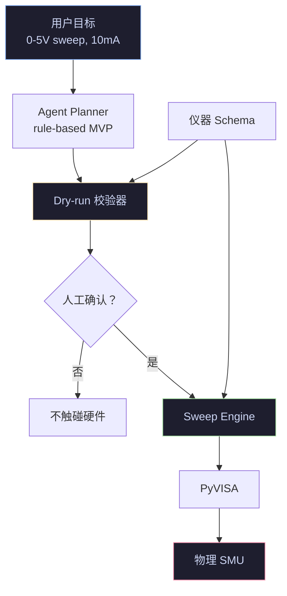
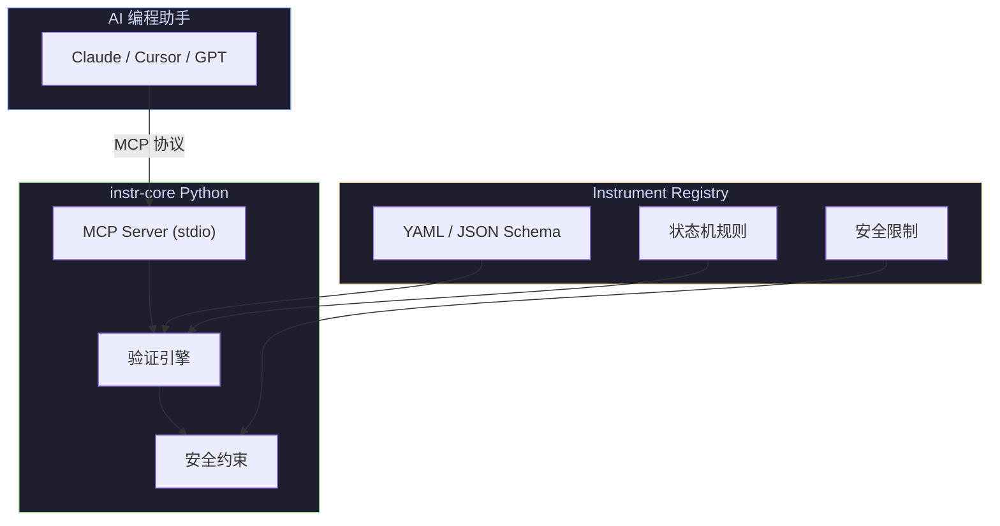
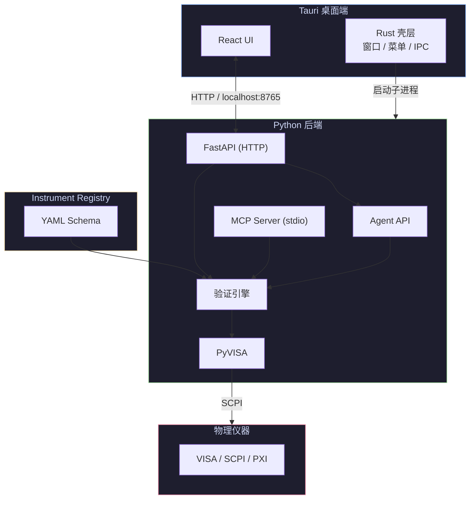

<div align="center">

# instr-core

**面向仪器控制的 AI 实验代理与物理安全层。**

[](./LICENSE)
[](https://www.python.org/)
[]()
[](./README.md)

[instr.cc](https://instr.cc) · [English](./README.md)

</div>

---

## instr-core 是什么？

`instr-core` 是一个 AI 原生的仪器控制核心。它让 AI 可以规划实验、根据结构化仪器 Schema 校验每一条硬件指令、默认先进行 dry-run，并且只有在用户显式确认后才允许通过 VISA/SCPI 操作真实仪器。

项目分为三层：

1. **Agent 层** — 将高层级实验目标转换成结构化、可验证的实验计划。
2. **安全层** — 校验量程、状态切换、compliance、输出状态和指令顺序。
3. **运行时层** — 通过 MCP、FastAPI 和 Tauri 桌面应用暴露同一个核心能力。

第一条 Agent workflow 是 **AI 驱动 IV sweep**：

```text
自然语言实验目标
  → 结构化 IV sweep plan
  → dry-run 安全校验
  → 用户显式确认
  → PyVISA 执行
  → 数据、CSV、图表和运行摘要
```

---

## 为什么 AI 控制真实硬件会有问题？

现在的通用大模型（比如 GPT-4o、Claude 3.5 Sonnet）确实懂 Python，甚至背过 PyVISA 的 API 文档。但是它们有两个致命缺陷：

**没有"这台"仪器的说明书：**

同样的吉时利（Keithley）电源，型号 2400 和 2450 的底层 SCPI 指令细节、寄存器状态位可能完全不同。AI 经常靠"猜"来写指令，很容易报错。

**没有物理常识与安全边界：**

AI 不知道一台只能承受 10V 的精密设备，如果被写入了 `SOUR:VOLT 50` 会直接烧毁。它只是在输出文本。

---

## instr-core 是如何辅助 AI 的？

这个项目将仪器操作变成适合 AI Agent 的 plan-validate-execute 工作流：

**给 AI 喂结构化的"仪器字典" (Schema)：**

不需要人类把几百页的英文 PDF 手册丢给 AI 让它慢慢总结。instr-core 提倡用标准化的 YAML/JSON 文件把仪器的能力、量程、指令集固化下来。AI 写代码前，直接读取这个 Schema（上下文），瞬间就知道这台仪器能干什么、不能干什么。

**强制 dry-run 与校验：**

当 AI 提出一个实验计划或一条 SCPI 指令时，instr-core 会先验证它。系统会检查：电压是否超限？是否设置了 compliance？输出是否已经开启？这条指令是否违反仪器状态机？如果计划不安全，系统返回问题和修复建议，而不是触碰硬件。

**只有确认后才执行：**

Agent plan 默认从 `dry_run` 模式开始。真实执行必须带有显式确认标志，并且 dry-run 结果必须有效。这是项目的核心物理安全边界：AI 可以规划，但不能悄悄给硬件上电。

---

## AI 实验代理

新的 Agent 接口面向“用户描述实验目标”的场景，而不是要求用户手写命令序列。

示例请求：

```text
使用连接的 Keithley，从 0V 扫到 5V，步进 0.1V，compliance 10mA。
```

Agent API 会解析成结构化 plan：

```json
{
  "experiment_type": "iv_sweep",
  "mode": "dry_run",
  "instrument_key": "keithley/smu/2600",
  "address": "USB0::INSTR",
  "config": {
    "start_voltage": 0,
    "stop_voltage": 5,
    "step": 0.1,
    "compliance": 0.01,
    "delay_ms": 10,
    "direction": "UP"
  },
  "requires_confirmation": true
}
```

当前 Agent API：

| Endpoint | 作用 |
| --- | --- |
| `POST /agent/plan` | 将自然语言 IV sweep 目标解析成结构化 plan。 |
| `POST /agent/dry-run` | 校验 plan、展开命令预览、估算点数并返回安全问题。 |
| `POST /agent/execute` | 仅在 dry-run 有效且 `confirm=true` 时启动 sweep。 |
| `GET /agent/runs/{run_id}` | 查询 agent run、校验结果和关联 sweep session。 |

第一版使用确定性的 rule-based parser，而不是直接接 LLM provider。这样硬件边界是可测试的：未来 LLM 也只能生成同一个结构化 `AgentPlan`，不能直接发裸 SCPI。

---

## 这对未来的测试工程师意味着什么？

如果这种模式（基于 Schema 的 AI 硬件驱动层）成熟并成为行业标准，硬件测试工程师的工作方式将发生彻底改变：

**过去：**

工程师手里拿着万用表和仪器编程手册，一行行手敲 SCPI 指令，封装底层的 Python 类。

**未来：**

工程师转变为"规则制定者"。你的核心工作是编写和维护仪器的 YAML Schema（定义安全边界、状态机），然后对 AI 下达高层级指令："帮我写一个脚本，扫描 1V 到 5V 之间芯片的漏电流，步进 0.1V，并在图表上画出来。" 剩下的底层握手、防呆设计，全部由 AI + instr-core 自动完成。

工程师的核心价值从"操作者"升维为"规则设计者"，AI 只是执行你定义安全边界的工具。

---

## 架构

`instr-core` 有一个共享安全核心和三套运行时界面：

### 1. Agent API（实验工作流）



### 2. MCP Server（AI 编程工作流）


### 3. 桌面应用（人工 + AI 工作流）


桌面应用共享同一个 Python 后端：用户可以手动控制仪器、运行经过校验的 IV sweep，后续也可以在桌面任务面板中驱动同一套 Agent API。

---

## MCP 工具

instr-core 通过 MCP 协议向 AI 暴露以下工具，所有调用均在代码生成前完成，绝不直接操作硬件：

| 工具 | 作用 |
| --- | --- |
| `validate_instrument_state` | 校验单条 SCPI 命令是否合法（量程、状态、安全规则）。 |
| `validate_command_sequence` | 校验一整段命令序列，追踪跨命令的状态变迁。 |
| `list_instruments` / `search_instruments` | 浏览 Registry 中已加载的仪器及其元数据。 |
| `get_command_tree` | 获取某台仪器的完整 SCPI 指令树。 |
| `get_command_detail` | 获取单条指令的详细约束（range、requires、forbidden_when、safety）。 |
| `get_safety_limits` | 获取仪器的全局安全边界（电压、电流、功率上限）。 |
| `get_instrument_sop` (prompt) | 根据仪器 Schema 生成带安全检查的 PyVISA 代码模板。 |

---

## 指令即上下文（Instructions as Context）

`instr-core` 提出了一个新的理念：

> **指令即上下文（Instructions as Context）**

| 传统方式 | instr-core |
| --- | --- |
| PDF 手册 → 人类阅读 → 手写代码 | 结构化 Schema → AI 理解 → 安全生成代码 |

---

## Schema 示例

`instr-core` 的 Schema 是一个完整的仪器描述文件，而不仅是命令列表。以下是一个基于真实 registry 的简化结构：

```yaml
instrument:
  manufacturer: Keithley
  model: "2600"
  description: "Series 2600A System SourceMeter"

global_limits:
  voltage: {max: 40.0, unit: "V"}
  current: {max: 3.0, unit: "A"}
  power: {max: 200.0, unit: "W"}

commands:
  - command: ":SOUR:VOLT"
    description: "Set the source voltage level"
    parameters:
      - name: "voltage"
        type: "float"
    range:
      min: -40.0
      max: 40.0
    requires:
      source_mode: VOLT
    forbidden_when:
      output: ON
    safety:
      compliance_required: true
      compliance_parameter: ":SENS:CURR:PROT"
    sets_state:
      ":SOUR:VOLT": "$ARGUMENT"
```

关键字段说明：

- `global_limits` — 全局安全边界（电压、电流、功率上限）。
- `requires` — 命令执行的前置状态条件（例如 `:SOUR:VOLT` 只能在 `source_mode: VOLT` 时执行）。
- `forbidden_when` — 禁止执行的状态（例如输出开启时禁止修改源值）。
- `safety` — 安全规则，如是否必须先设置 compliance。
- `sets_state` — **状态追踪引擎的核心**。它告诉系统该命令执行后会改变什么状态（例如 `$ARGUMENT` 表示把传入的参数值记录到状态中）。instr-core 依靠这个字段在命令序列中维护虚拟仪器状态，从而实现跨命令的依赖与冲突检查。

这意味着 AI 不再只是"记忆指令"，而是真正获得 **仪器行为约束**。

---

## 示例：安全 IV Sweep

**没有 instr-core：**

```python
smu.write(":SOUR:VOLT 200")   # 可能超出仪器量程（2600 最大 40V）
smu.write(":OUTP ON")         # 未设置 compliance，DUT 可能过流烧毁
```

潜在问题：
- 未检查 `global_limits.voltage.max`
- 未设置 `:SENS:CURR:PROT` 即开启输出，违反 `safety.compliance_required`
- 未确认 `source_mode` 是否为 `VOLT`

**使用 instr-core：**

AI 先读取 Schema，了解到：
- `:SOUR:VOLT` 的合法范围是 `[-40.0, 40.0]`
- `:OUTP ON` 之前必须已配置 compliance 键（`:SENS:CURR:PROT` 或 `:SENS:VOLT:PROT`）（由 `safety.sequence.require_state_keys_present` 定义）
- `:SOUR:VOLT` 在 `output: ON` 时被 `forbidden_when` 禁止

于是生成安全代码：

```python
smu.write("*RST")
smu.write(":OUTP OFF")
smu.write(":SOUR:FUNC VOLT")          # 满足 requires.source_mode
smu.write(":SENS:CURR:PROT 0.01")     # 先设置 compliance（10mA）
smu.write(":SOUR:VOLT:RANG 20")
smu.write(":SOUR:VOLT 0")
smu.write(":OUTP ON")
# ... sweep 逻辑，每步电压都在 [-40, 40] 范围内
smu.write(":OUTP OFF")                # Schema 建议测试结束后关闭输出
```

---

## 快速开始

### 前置要求

- [uv](https://docs.astral.sh/uv/) 用于 Python 包和环境管理
- [Node.js](https://nodejs.org/) (>= 20) 用于桌面 UI
- [Rust](https://rustup.rs/) (>= 1.75) 用于 Tauri 壳层

### 1. 安装与运行 Python 核心 / MCP Server

```bash
# 克隆仓库
git clone <repo-url>
cd instr-core

# 同步 Python 依赖
uv sync

# 运行 MCP server
uv run instr-core
```

### 2. 桌面应用（Tauri + React + Python）

桌面应用提供现代化的原生 UI 用于仪器控制，同时保留相同的 Python 后端和 MCP 服务。

```bash
# 1. 启动 Python API 后端
uv run python src/instr_core/api_server.py

# 2. 在第二个终端启动 Tauri 开发环境
cd desktop
npm install
cargo tauri dev
```

桌面窗口会在 `http://localhost:1420` 打开，通过 `http://localhost:8765` 与 Python 后端通信。

**生产构建：**

```bash
cd desktop
cargo tauri build
# 输出：desktop/src-tauri/target/release/bundle/
```

### 3. Agent API：Plan、Dry-run、Execute

启动 Python API 后端：

```bash
uv run python src/instr_core/api_server.py
```

创建 plan：

```bash
curl -X POST http://localhost:8765/agent/plan \
  -H "Content-Type: application/json" \
  -d '{
    "goal": "Sweep 0V to 5V in 0.5V steps with 10mA compliance",
    "instrument_key": "keithley/smu/2600",
    "address": "USB0::INSTR"
  }'
```

如果仪器已经通过 `/visa/connect` 连接，Agent API 可以从 address 映射推断 `instrument_key`。显式传入 `instrument_key` 更适合 dry-run 规划和测试。

对返回的 `run_id` 做 dry-run：

```bash
curl -X POST http://localhost:8765/agent/dry-run \
  -H "Content-Type: application/json" \
  -d '{"run_id": "run-xxxxxxxx"}'
```

审核后再执行：

```bash
curl -X POST http://localhost:8765/agent/execute \
  -H "Content-Type: application/json" \
  -d '{"run_id": "run-xxxxxxxx", "confirm": true}'
```

执行步骤有意要求显式确认。不带 `confirm=true` 调用会直接返回错误。

### 4. 配置你的 IDE / AI 助手（MCP）

> **注意：** IDE 中配置时，工作目录可能不是项目根目录。请使用 **绝对路径** 指定 registry，或设置 `INSTR_CORE_REGISTRY` 环境变量。

**Claude Desktop** — 编辑配置文件：

- **macOS**: `~/Library/Application Support/Claude/claude_desktop_config.json`
- **Windows**: `%APPDATA%\Claude\claude_desktop_config.json`

```json
{
  "mcpServers": {
    "instr-core": {
      "command": "uv",
      "args": ["run", "--cwd", "/absolute/path/to/instr-core", "instr-core"]
    }
  }
}
```

或者，如果 Claude Desktop 中 `uv` 不在系统 `PATH` 上：

```json
{
  "mcpServers": {
    "instr-core": {
      "command": "uv",
      "args": [
        "run",
        "instr-core"
      ],
      "env": {
        "PATH": "/path/to/your/env/bin"
      }
    }
  }
}
```

**Cursor** — 添加到 `.cursor/mcp.json`：

```json
{
  "mcpServers": {
    "instr-core": {
      "command": "uv",
      "args": ["run", "--cwd", "/absolute/path/to/instr-core", "instr-core"]
    }
  }
}
```

**Claude Code** — 添加到 `.claude/settings.json`：

```json
{
  "mcpServers": {
    "instr-core": {
      "command": "uv",
      "args": ["run", "--cwd", "/absolute/path/to/instr-core", "instr-core"]
    }
  }
}
```

### 5. 配好之后是什么效果？

配置完成后，AI 助手将获得仪器感知能力。以下是典型的使用场景：

**你在 AI 对话框中输入：**

> 写一个 Python 脚本，在 Keithley 2600 上跑 IV sweep，0-20V，compliance 10mA。

**没有 instr-core 时**，AI 生成：

```python
# AI 幻觉输出 — 看起来合理，实际上可能损坏仪器
smu = visa.ResourceManager().open_resource("USB0::0x05E6::0x2600::INSTR")
smu.write(":SOUR:FUNC VOLT")
smu.write(":SOUR:VOLT 20")          # 没有检查量程
smu.write(":OUTP ON")                # 没有设置 compliance — DUT 有风险
```

**使用 instr-core 后**，AI 先查询 Schema，再生成：

```python
# Schema 驱动输出 — 约束已应用
smu = visa.ResourceManager().open_resource("USB0::0x05E6::0x2600::INSTR")
smu.write(":SOUR:FUNC VOLT")
smu.write(":SENS:CURR:PROT 0.01")    # Compliance 来自 Schema：10mA
smu.write(":SOUR:VOLT:RANG 20")      # 显式声明量程
smu.write(":SOUR:VOLT 0")            # 从安全状态开始
smu.write(":OUTP ON")
# ... sweep 逻辑，电压步进遵循 Schema 约束
smu.write(":OUTP OFF")               # Schema 要求结束后关闭输出
```

AI 还会输出验证摘要：

> **instr-core 验证通过**
> - Compliance：已设置 10mA
> - 电压范围：0-20V（在仪器限制内）
> - 输出状态：sweep 前 OFF，sweep 后 OFF
> - Source 模式：VOLT（匹配要求）

---

## 核心特性

- **AI 实验代理** — 自然语言 IV sweep 规划、dry-run 校验、确认后执行和 run 状态追踪。
- **标准化 Instrument Schema** — 用结构化 YAML / JSON 替代 PDF 手册。
- **安全验证层** — 防止超量程、非法状态切换、危险输出、错误模式组合。
- **FastAPI Agent API** — 提供 `/agent/plan`、`/agent/dry-run`、`/agent/execute`、`/agent/runs/{run_id}`。
- **原生 MCP 支持** — 兼容 Cursor、Claude Code、Windsurf、VSCode AI Agent。
- **Python 核心运行时** — 基于官方 [MCP Python SDK](https://github.com/modelcontextprotocol/python-sdk) (FastMCP)，易于扩展，可无缝集成现有 Python 仪器控制工作流。
- **社区仪器 Registry** — 支持 Keithley、Keysight、Tektronix、Rohde & Schwarz、NI PXI 以及更多 SCPI 仪器。
- **桌面应用**（Tauri + React + Python）— 现代化的原生 UI，支持仪器发现、SCPI 终端和手动控制。打包为单文件可执行程序。

---

## 项目理念

`instr-core` **不是**:

- SCPI 自动补全工具
- PDF 转 YAML 工具
- 允许 AI 绕过人工确认直接给硬件上电的系统

它 **是**:

> **带有保守物理安全层的 AI 实验代理核心。**

目标不是替代工程师，而是让 AI 在明确、可审核、Schema 校验过的安全边界内提出并执行实验。

---

## 安全声明

**真实硬件执行前，始终需要人工审核。**

`instr-core` 提供：

- Dry-run 规划
- 约束验证
- 状态检查
- 指令语义
- 确认后执行
- 风险降低

但 **不保证**:

- 代码绝对正确
- 仪器绝对安全
- 硬件绝对不会损坏

---

## 桌面应用

`instr-core` 包含一个可选的原生桌面应用，基于 **Tauri**（Rust 壳层）+ **React**（UI）+ **Python**（后端）。

### 为什么需要桌面应用？

MCP Server 非常适合 AI 辅助编程，但工程师也需要一个独立工具来完成：
- 快速扫描 VISA 资源并连接仪器
- 手动发送 SCPI 指令并获得实时验证反馈
- 在可浏览的 UI 中查看仪器 Schema 和安全限制
- 无需编写 Python 脚本即可运行 IV sweep 和捕获数据

### 架构

```
┌─────────────────────────────┐
│  Tauri (Rust + Web UI)      │  ← 用户面对的原生窗口
│  - React 仪器面板           │
│  - SCPI 终端                │
│  - 数据可视化               │
└──────┬──────────────────────┘
       │ HTTP / WebSocket (localhost)
       ▼
┌─────────────────────────────┐
│  Python 后端                │  ← 与 MCP 工作流共享
│  - FastAPI 本地服务         │
│  - PyVISA 仪器通信          │
│  - MCP Server（给 AI 用）   │
│  - 验证引擎                 │
└─────────────────────────────┘
```

Rust 壳层（`desktop/src-tauri/`）在启动时自动拉起 Python 后端，并在原生窗口中加载 React UI。UI 通过 `localhost:8765` 上的 HTTP 与 Python 通信。

### 通信方式

| 层级 | 技术 | 职责 |
|---|---|---|
| 壳层 | Tauri (Rust) | 窗口管理、菜单栏、原生对话框、进程生命周期 |
| 前端 | React + Vite | 仪器面板、SCPI 终端、图表、设置 |
| 传输 | HTTP / REST | React 与 Python 之间的 JSON API |
| 后端 | FastAPI + uvicorn | 请求路由、VISA 资源管理、验证 |
| 引擎 | Python（共享） | Schema 解析、指令验证、状态追踪 |

### 文件结构

```text
desktop/
├── package.json              # Node 依赖（React、Tauri API）
├── vite.config.ts            # Vite 开发服务器（端口 1420）
├── tsconfig.json
├── index.html
└── src/
    ├── main.tsx              # React 入口
    ├── App.tsx               # 主布局（面板 + 终端）
    └── App.css               # 暗色主题样式
└── src-tauri/
    ├── Cargo.toml            # Rust 依赖（Tauri）
    ├── tauri.conf.json       # 窗口配置、打包设置
    ├── build.rs
    └── src/
        ├── main.rs           # 启动 Python 后端，管理生命周期
        └── lib.rs
```

## Registry 结构

```text
tests/fixtures/registry/
└── keithley/
    └── smu/
        └── 2600.yaml
```

每个 Schema 可包含：

- 固件版本
- SCPI 指令树
- 参数约束
- 状态机规则
- 安全限制
- 官方文档来源

---

## Roadmap

**当前重点**

- AI IV sweep agent
- Keithley 2400 / 2600
- SCPI SourceMeter
- PyVISA 工作流
- dry-run-first 硬件执行
- **Tauri 桌面应用** — 仪器面板、SCPI 终端、数据捕获

**未来计划**

- LLM 驱动的结构化规划
- 桌面 Agent 面板
- 用于实验规划和执行的 MCP tools
- 示波器语义模型
- PXI 系统支持
- 二进制协议
- 真机验证
- Capability Graph
- 自动 PDF 解析
- 硬件执行沙箱
- 数据可视化（绘图、sweep、测量）
- 多仪器同步序列

---

## 长期愿景

AI 正在从"生成代码"走向"控制物理世界"。而物理世界需要：

- 类型系统
- 状态验证
- 安全约束
- 可追踪性
- 执行语义

`instr-core` 希望成为：

> **AI 与真实硬件之间的可信上下文层。**

---

## 贡献

欢迎贡献：

- 仪器 Schema
- SCPI 语义
- 安全规则
- PXI 支持
- 协议适配器
- 真机测试

---

## 许可证

[MIT](./LICENSE)
